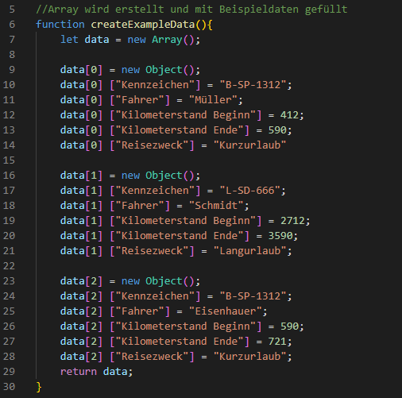
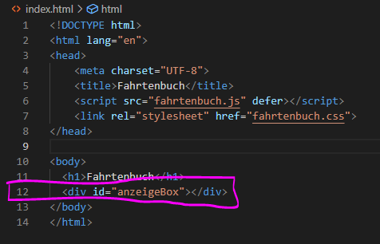
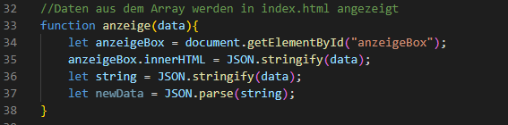

# Fahrtenbuch
## GitHub Pages
https://labpa.github.io/Fahrtenbuch/

## Aufgabenstellung
Erstellen sie eine Fahrtenbuch App, welche komplett im Browser läuft.
In der App sollen neue Fahrten erfasst werden können und eine Liste mit alten Fahrten angezeigt werden. Die Daten sollen sich als Json Datei aus dem Browser heruntergeladen oder wieder in den Browser geladen werden können.
Die Daten sollen im WebStorage des Browsers gespeichert werden.  

Als Start Kilometerstand sollte der letzte Endkilometerstand vorgeschlagen werden.
Ein Beispiel zum Dateidownload und Upload finden sie in der Datei.html Datei.

## Dokumentation
### html
+ erstellen einer index.html

### Array erstellen

### Ausgabe Array in html 

### Ausgabe Array in JavaScript

